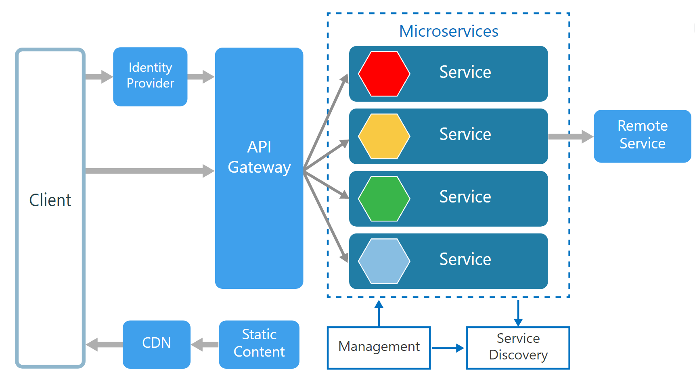

# Go-Micro

**Go-Micro** is a golang package that implements Micro-service architecture 
using **go-kit**.

## What is this project?
In this project, I implemented a microservice application that does string
operations like concat, count, split, ...

The base idea behind this project was to work with **go-kit**, and learn how
to implement a golang application using microservice architecture.

To see how does this project work, check the following schema:<br />


## What is go-kit?
Go kit is a programming toolkit for building microservices 
(or elegant monoliths) in Go. 
It solves common problems in distributed systems and application architecture,
so you can focus on delivering business value.

Go is a great general-purpose language, 
but microservices require a certain amount of specialized support. 
RPC safety, system observability, infrastructure integration, 
even program design — Go kit fills in the gaps left by the standard library, 
and makes Go a first-class language for writing microservices in any organization.

## How to use this project?
#### uppercase string
url:
```shell
[HOST]:[PORT]/uppercase
```

method:
```shell
POST
```

request:
````go
type UppercaseRequest struct {
	S string `json:"s"`
}
````

response:
```go
type UppercaseResponse struct {
	V   string `json:"v"`
	Err string `json:"err,omitempty"`
}
```

#### lowercase string
url:
```shell
[HOST]:[PORT]/lowercase
```

method:
```shell
POST
```

request:
````go
type LowercaseRequest struct {
    S string `json:"s"`
}
````

response:
```go
type LowercaseResponse struct {
    V   string `json:"v"`
    Err string `json:"err,omitempty"`
}
```

#### string length
url:
```shell
[HOST]:[PORT]/count
```

method:
```shell
POST
```

request:
````go
type CountRequest struct {
    S string `json:"s"`
}
````

response:
```go
type CountResponse struct {
    V int `json:"v"`
}
```

#### concatenate string
url:
```shell
[HOST]:[PORT]/concatenate
```

method:
```shell
POST
```

request:
````go
type ConcatenateRequest struct {
    S string `json:"s"`
    C string `json:"c"`
}
````

response:
```go
type ConcatenateResponse struct {
    V   string `json:"v"`
    Err string `json:"err,omitempty"`
}
```

#### split string
url:
```shell
[HOST]:[PORT]/split
```

method:
```shell
POST
```

request:
````go
type SplitRequest struct {
    S string `json:"s"`
    K string `json:"k"`
}
````

response:
```go
type SplitResponse struct {
    V   []string `json:"v"`
    Err string   `json:"err,omitempty"`
}
```

## Setup project
### Docker
Use the following command to run the project on docker:
```shell
docker compose up -d
```

### Local
Use the following command to run the project on local:
```shell
make start
```